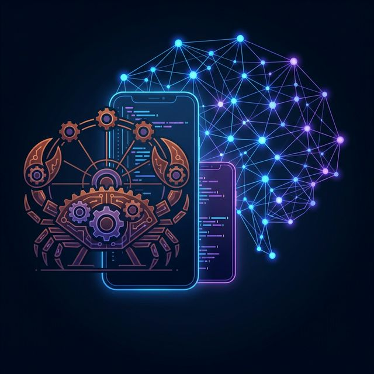

# 👋 Hello, I'm Sonu Kumar

**Senior Software Engineer | Rust Evangelist | Mobile & AI Developer**

Building high-performance systems and delightful mobile experiences. Passionate about Rust, Systems Programming, and the future of AI.

---

### 🚀 Core Expertise

- **🦀 Systems Programming**: Rust (Ownership, Concurrency, Performance), Systems Design.
- **📱 Mobile Development**: Expo, React Native, NativeWind, Kotlin (Android).
- **🤖 AI & Tooling**: LLM Fine-tuning (Qwen), AI Coding Assistants, Developer SDKs.
- **🔗 Integrations**: AuthSetu, MCP (Model Context Protocol).

---

### 🛠️ Featured Projects

| Project | Description | Tech Stack |
| :--- | :--- | :--- |
| **[30-days-of-rust](https://github.com/sonurust/30-days-of-rust)** | A deep dive into mastering Rust through daily challenges. | Rust, Cargo |
| **[expo-nativewind-template](https://github.com/sonurust/expo-nativewind-template)** | Professional starter kit for Expo + TailwindCSS. | React Native, TypeScript |
| **[kilocode](https://github.com/sonurust/kilocode)** | AI-powered coding assistant for planning and execution. | Python, AI, Git |
| **[WaterTrackDrinkWaterReminder](https://github.com/sonurust/WaterTrackDrinkWaterReminder)** | Modern Android app for daily water tracking with reminders. | Kotlin, Android SDK |
| **[authsetu-node-sdk](https://github.com/sonurust/authsetu-node-sdk)** | Seamless authentication integration for Node.js apps. | JavaScript, Auth |

---

### 📈 GitHub Stats

  
  

---

### 📬 Connect with Me

- 📧 Email: [sonurust@gmail.com](mailto:sonurust@gmail.com)
- 💬 Discord: `sonurust`
- 💼 LinkedIn: [LinkedIn Profile](https://www.linkedin.com/in/sonurust/) (Update this link!)
- 📱 Phone: +91-9810218672

---

  <i>"Code is poetry, Rust is the ink."</i>

