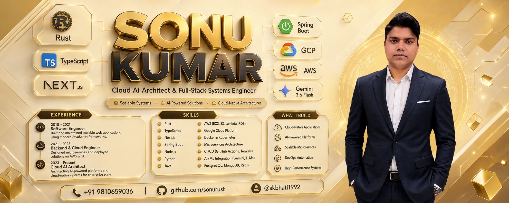

  

# Hi there, I'm Sonu Kumar 👋
### Senior Software Developer • Full-Stack & Cloud AI Architect • Mobile Specialist
**10+ Years of Experience Building Scalable Distributed Systems, Mobile Apps & Intelligent Platforms**

 

---

## 📄 Resume & Quick Downloads

| Document | Format | Action Links |
|:---|:---:|:---|
| **Sonu Kumar - Senior Software Developer Resume** | `PDF` | [📥 **Download PDF**](./Sonu_Kumar_Resume.pdf) • [👁️ **View on GitHub**](https://github.com/sonurust/sonurust/blob/main/Sonu_Kumar_Resume.pdf) • [🌐 **Raw File Link**](https://raw.githubusercontent.com/sonurust/sonurust/main/Sonu_Kumar_Resume.pdf) |
| **Printable Resume Source** | `HTML / CSS` | [📝 **View Source (resume.html)**](./resume.html) |

---

## 👨‍💻 About Me

Passionate **Senior Software Developer & Architect** with **10+ years of professional experience** delivering high-performance backend microservices, modern responsive web applications, native & cross-platform mobile apps, and cutting-edge GenAI/Agentic systems. 

- ⚡ **Backend & Distributed Systems:** Java 21, Spring Boot, Node.js, Go, Rust, Kafka, RabbitMQ, Microservices, OCPP/OCPI Protocols.
- 📱 **Mobile App Engineering:** React Native, Flutter, Android Native (Java/Kotlin), iOS Native (Swift), Clean Architecture / MVVM / BLoC.
- 🌐 **Modern Frontend:** React 19, Next.js 15, TypeScript, Tailwind CSS, WebSockets, Server-Sent Events (SSE).
- ☁️ **Cloud, DevOps & IaC:** AWS (ECS Fargate, Lambda, EC2, S3, CloudFront), GCP, Docker, Kubernetes, Terraform, CI/CD.
- 🤖 **AI / ML & Agentic Systems:** LLMs (Gemini, OpenAI, Claude), Model Context Protocol (MCP), LangChain, RAG Pipelines, n8n Automation.
- 🎓 **Academic Background:** Executive PG in Data Science (**IIIT Bangalore**), MCA (**NIET**), BCA (**IP College**).

---

## 🛠️ Tech Stack & Expertise

<table>
  <tr>
    <td width="22%"><strong>Programming Languages</strong></td>
    <td><code>Java (8/17/21)</code>, <code>Kotlin</code>, <code>Swift</code>, <code>TypeScript</code>, <code>JavaScript</code>, <code>Dart</code>, <code>Go (Golang)</code>, <code>Rust</code>, <code>Python</code>, <code>SQL</code></td>
  </tr>
  <tr>
    <td><strong>Backend & Frameworks</strong></td>
    <td><code>Spring Boot 3</code>, <code>Hibernate/JPA</code>, <code>Node.js</code>, <code>Express.js</code>, <code>RESTful APIs</code>, <code>GraphQL</code>, <code>Kafka</code>, <code>RabbitMQ</code>, <code>OCPP 1.6/2.0.1 & OCPI</code></td>
  </tr>
  <tr>
    <td><strong>Frontend & Web</strong></td>
    <td><code>React.js</code>, <code>Next.js 15</code>, <code>Tailwind CSS</code>, <code>HTML5/CSS3</code>, <code>Redux Toolkit</code>, <code>Server Actions</code>, <code>SSE</code></td>
  </tr>
  <tr>
    <td><strong>Mobile Development</strong></td>
    <td><code>Flutter (Dart)</code>, <code>React Native (TS)</code>, <code>Android Native (SDK/Kotlin/Java)</code>, <code>iOS Native (Swift/SwiftUI/UIKit)</code>, <code>BLoC / GetX / Provider</code>, <code>MVVM / Clean Architecture</code></td>
  </tr>
  <tr>
    <td><strong>AI / ML & LLMs</strong></td>
    <td><code>Model Context Protocol (MCP)</code>, <code>Google Gemini</code>, <code>OpenAI API</code>, <code>Claude</code>, <code>LangChain</code>, <code>RAG Pipelines</code>, <code>TensorFlow</code>, <code>PyTorch</code>, <code>Scikit-learn</code>, <code>Prompt Engineering</code></td>
  </tr>
  <tr>
    <td><strong>Cloud & DevOps</strong></td>
    <td><code>AWS (EC2, ECS Fargate, S3, Lambda, CloudFront, Route 53, VPC)</code>, <code>GCP (Cloud Run, Vertex AI, Firestore)</code>, <code>Docker</code>, <code>Kubernetes</code>, <code>Terraform</code>, <code>GitHub Actions</code>, <code>Jenkins</code>, <code>Cloudflare</code></td>
  </tr>
  <tr>
    <td><strong>Databases & Storage</strong></td>
    <td><code>PostgreSQL</code>, <code>MySQL</code>, <code>MongoDB</code>, <code>Redis</code>, <code>SQLite</code>, <code>Room</code>, <code>Firebase Firestore</code>, <code>AWS S3</code></td>
  </tr>
  <tr>
    <td><strong>Tools & Environments</strong></td>
    <td><code>Android Studio</code>, <code>Xcode</code>, <code>VS Code</code>, <code>Git</code>, <code>Postman</code>, <code>Jira</code>, <code>Jupyter Notebook</code>, <code>n8n</code></td>
  </tr>
</table>

---

## 💼 Work Experience

### 🏢 **Infoskills Technology Pvt Ltd, Noida** — *Senior Software & Full Stack Developer*
📅 `May 2022 – Present`

- **TelioEV (EV Charging Platform):** Redesigned and engineered the EV charging mobile app (React Native, TS) & Java Spring Boot backend integrating **OCPP & OCPI protocols**. Deployed scalable microservices on AWS (ECS Fargate, S3, VPC, Route 53, CloudFront) with automated CI/CD.
- **ElectricOne (Smart EV Charging):** Built high-performance EV charging app in Flutter & Dart implementing OCPP protocols, Firebase authentication, Firestore real-time data, and AWS S3 storage with Clean Architecture & BLoC.
- **Hyqoo (Talent Marketplace):** Developed cross-platform mobile marketplace app in Flutter & Dart with REST & GraphQL, Firebase real-time messaging, Provider/GetX state management, and S3 resume storage.
- **Salon Management System:** Architected end-to-end booking & salon management platform using Java Spring Boot microservices, Hibernate, PostgreSQL, Docker, and React.js frontend.
- **Model Context Protocol (MCP) Server Infrastructure:** Designed & deployed enterprise-grade MCP servers and multi-agent systems integrating OpenAI, Claude, and Google Cloud AI models with Terraform & Docker.
- **n8n Agent Workflow Automation:** Engineered custom n8n nodes, webhook listeners, and AI agent pipelines reducing manual business processes by 70%.

---

### 🏢 **Teliolabs Communication Pvt Ltd, Noida** — *iOS App Developer (Contract)*
📅 `Dec 2022 – Feb 2023`

- **Charge N'Go:** Developed native iOS application using **Swift**, **MapKit**, and CoreLocation for real-time EV station mapping, routing, status updates, and secure in-app payments (Stripe/Razorpay).

---

### 🏢 **Fluper Ltd, Noida** — *Senior Software Developer*
📅 `Feb 2020 – Apr 2022`

- Engineered robust enterprise web backends using **Node.js**, **React.js**, and **MongoDB**.
- Built cross-platform mobile applications in **Flutter** & native **Android**.
- Key delivered client projects: *Fuggu, RAL, DynDish, Payday, i12G, HOOT, CoachedIn, A2A, Clout, EmojiZone*.

---

### 🏢 **Hire Indians Infotech Pvt Ltd, Noida** — *Android Developer*
📅 `Aug 2019 – Jan 2020`

- Built scalable e-commerce and on-demand service mobile apps using **Java**, **Kotlin**, **Android SDK**, and **MVVM (LiveData, ViewModel, Room)**.
- Integrated Google Maps API live location tracking, payment gateways (Razorpay, Paytm), Firebase Push Notifications & Crashlytics.
- Key projects: *StyleOAK (E-Commerce), Doctor On Demand (Telehealth/Consultations), Quick Serve (On-Demand Car Wash)*.

---

### 🏢 **Metro Infrasys Pvt Ltd, Gurgaon** — *Android Developer*
📅 `May 2016 – Jul 2019`

- Developed intelligent transportation and highway management applications.
- Integrated AI voice assistants using **API.ai** and **IBM Watson** for safe, hands-free highway travel.
- Key projects: *Highway Saathi, Metro Parking, OBU AVS Alexa*.

---

### 🏢 **Zebrogs Technologies, Noida** — *Android Developer*
📅 `May 2015 – May 2016`

- Developed native Android e-commerce and sports event management applications using Android SDK.

---

## 🚀 Key Projects & Live Deployments

| Project | Role / Category | Tech Stack | Highlights & Links |
|:---|:---|:---|:---|
| **[TelioEV](https://telioev.com)** | EV Charging Platform | React Native, TypeScript, Spring Boot, OCPP, AWS | Scalable EV charging platform with dynamic tariffs, charger discovery & hardware communication. • [Live Site](https://telioev.com) |
| **[Charge N'Go (iOS)](https://apps.apple.com/in/app/charge-n-go-ev-charging/id6615081343)** | Native iOS EV App | Swift, MapKit, Firebase, Stripe/Razorpay | Real-time charger availability, live turn-by-turn navigation, and in-app checkout. • [App Store](https://apps.apple.com/in/app/charge-n-go-ev-charging/id6615081343) |
| **[Highway Saathi](https://play.google.com/store/apps/details?id=com.metroinfrasys.highwaysaathi)** | Highway Travel & Safety | Android (Java), Google Maps, IBM Watson, Retrofit | Safe highway mobility app featuring toll tag recharge, emergency SOS & voice commands. • [Play Store](https://play.google.com/store/apps/details?id=com.metroinfrasys.highwaysaathi) |
| **[DocSetuAI](https://github.com/sonurust/DocSetuAI)** | Autonomous AI Operations | Next.js 15, Gemini 3.6, Cloud Run, Firestore | Autonomous AI business intelligence & operations platform with real-time analytics. • [Live Demo](https://docsetuai.vercel.app) • [GitHub](https://github.com/sonurust/DocSetuAI) |
| **[RAG-LLM-golang-project](https://github.com/sonurust/RAG-LLM-golang-project)** | AI & Data Engineering | Go (Golang), pgvector, Embeddings, LLM | High-throughput Vector RAG Pipeline with semantic search and low-latency embeddings retrieval. • [GitHub](https://github.com/sonurust/RAG-LLM-golang-project) |
| **[enterprise-java21-developer-kit](https://github.com/sonurust/enterprise-java21-developer-kit)** | Enterprise Backend Kit | Java 21, Spring Boot 3, Docker, Microservices | Production-ready boilerplate for scalable cloud-native microservices and domain-driven design. • [GitHub](https://github.com/sonurust/enterprise-java21-developer-kit) |
| **[Agent-Skills-for-Context-Engineering](https://github.com/sonurust/Agent-Skills-for-Context-Engineering)** | Agentic AI & Tooling | Python, TypeScript, Multi-Agent Orchestration | Standardized agentic skills, contextual reasoning workflows, and prompt engineering protocols. • [GitHub](https://github.com/sonurust/Agent-Skills-for-Context-Engineering) |
| **[AuthSetu SDKs (Node & Python)](https://github.com/sonurust/authsetu-node-sdk)** | Developer SDKs | Node.js, TypeScript, Python 3, PyPI | Official client SDKs for AuthSetu identity, session handling, and access management. • [Node SDK](https://github.com/sonurust/authsetu-node-sdk) • [Python SDK](https://github.com/sonurust/authsetu-python-sdk) |

---

## 🎓 Education

- 🎓 **Executive PG in Data Science** — *International Institute of Information Technology, Bangalore (IIIT-B)* `(2022 – 2024)`
- 🎓 **Master of Computer Applications (MCA)** — *Noida Institute of Engineering & Technology (NIET)* `(2013 – 2015)`
- 🎓 **Bachelor of Computer Applications (BCA)** — *IP College, Bulandshahar* `(2010 – 2013)`

---

## 🏆 Key Achievements

- 🚀 **50+ Apps Published:** Deployed and maintained 50+ commercial mobile & web applications across Google Play Store, Apple App Store, and Cloud platforms.
- 💡 **HackforIndia (Mobile10X / Paytm):** Developed an innovative AI-assisted barcode food scanner for real-time consumer product safety.
- ⚡ **Monolith-to-Microservices Modernization:** Led multiple legacy architectural migrations to cloud-native microservices, slashing latency by **60%** and cloud infrastructure costs by **30%**.
- 🤖 **Agentic & GenAI Innovation:** Built enterprise Model Context Protocol (MCP) servers and integrated LLMs across automated business workflows.

---

## 📬 Contact & Connect

| Channel | Contact Details |
|:---|:---|
| 📧 **Email** | [skbhati2015@gmail.com](mailto:skbhati2015@gmail.com) • [sonurust@gmail.com](mailto:sonurust@gmail.com) |
| 📱 **Phone / WhatsApp** | [(+91) 9810659036](https://wa.me/919810659036) • [(+91) 9910525949](tel:+919910525949) |
| 🌐 **Portfolio & Live App** | [https://docsetuai.vercel.app](https://docsetuai.vercel.app) |
| 🐙 **GitHub** | [@skbhati199](https://github.com/skbhati199) • [@sonurust](https://github.com/sonurust) |
| 🧠 **CodeCrafters** | [app.codecrafters.io/users/skbhati199](https://app.codecrafters.io/users/skbhati199) |
| 📍 **Location** | Noida, Uttar Pradesh, India |

 

  Designed & Maintained with ❤️ by Sonu Kumar

